# 🛠️ AWS Custom VPC, EC2 Instances & S3 Static Website Hosting

This project demonstrates the process of building a secure and scalable network environment using **Amazon Web Services (AWS)**. The major components include:

- A **custom VPC** with both public and private subnets
- Launching **EC2 instances** in both subnets
- Configuring **routing** for internet access
- Hosting a **static website using Amazon S3**

---

## 🧱 Project Architecture Overview

### ✅ Components Created:
- VPC CIDR block: `10.0.0.0/16`
- Public Subnet: `10.0.1.0/24`
- Private Subnet: `10.0.2.0/24`
- Internet Gateway attached to the VPC
- Route tables to enable and control internet access
- Two EC2 instances:
  - Public instance (with internet access)
  - Private instance (no direct internet access)
- S3 bucket hosting a simple static website

---

## 1️⃣ VPC and Subnet Configuration

### VPC
- Created a custom VPC named `MyCustomVPC`
- CIDR block: `10.0.0.0/16`

### Subnets
- **Public Subnet:** `10.0.1.0/24`
- **Private Subnet:** `10.0.2.0/24`

### Screenshots:
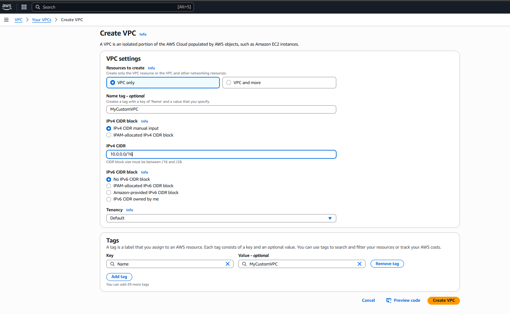
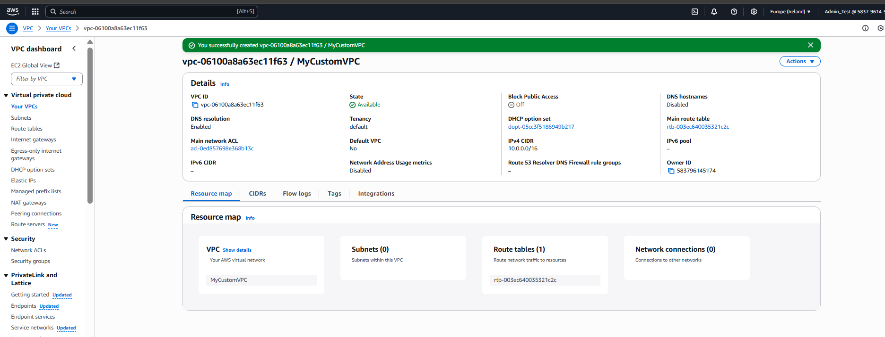
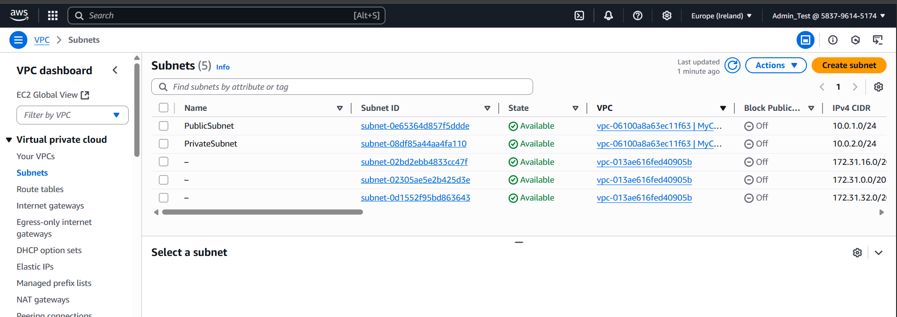

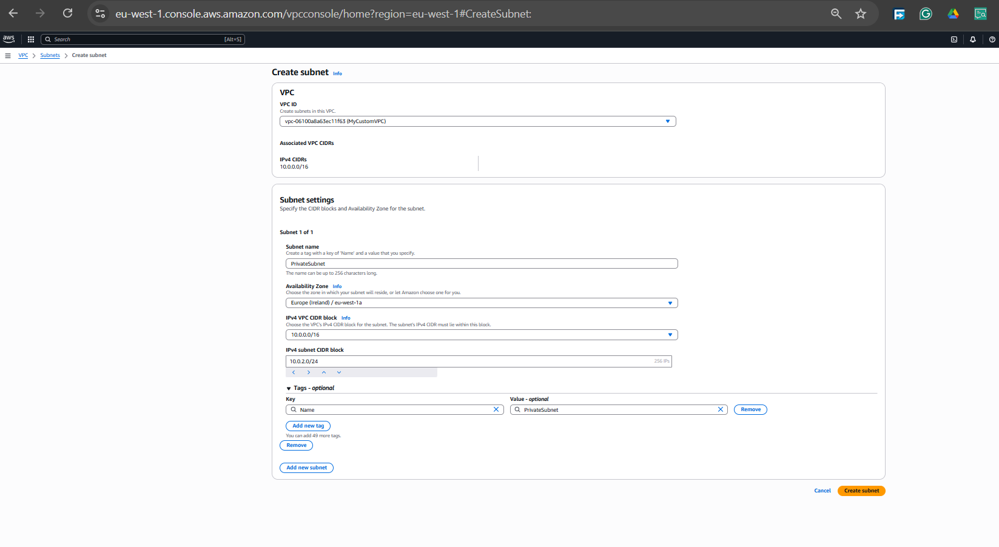

---

## 2️⃣ Internet Gateway and Routing

### Internet Gateway
- Created and attached an Internet Gateway (`MyIGW`) to the VPC

### Screenshot:
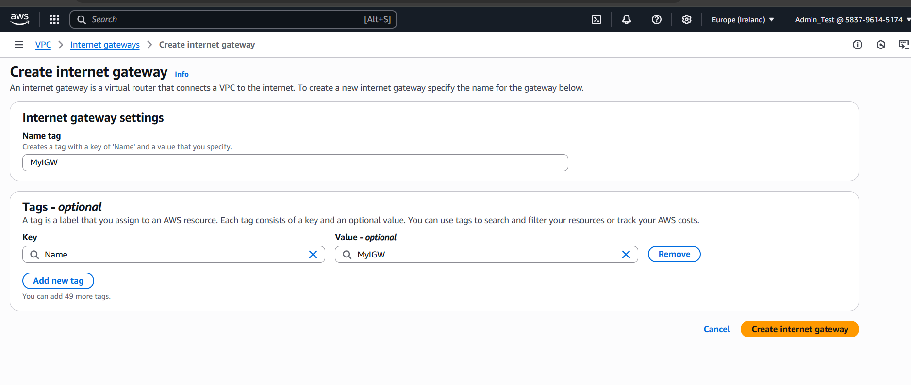
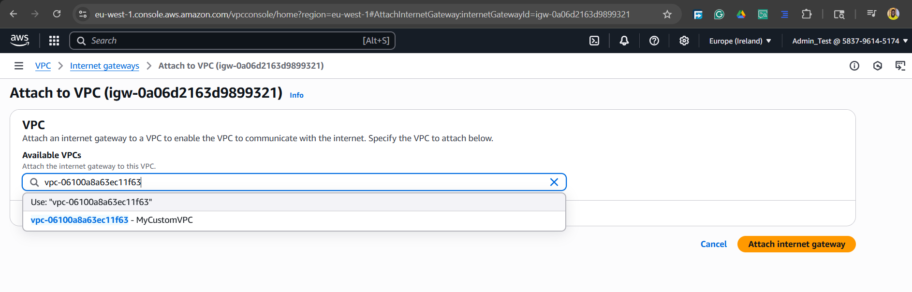

### Route Table
- Created a **custom route table** named `PublicRouteTable`
- Added a route: `0.0.0.0/0` → points to the Internet Gateway
- Associated this route table with the **public subnet** only

### Screenshot:
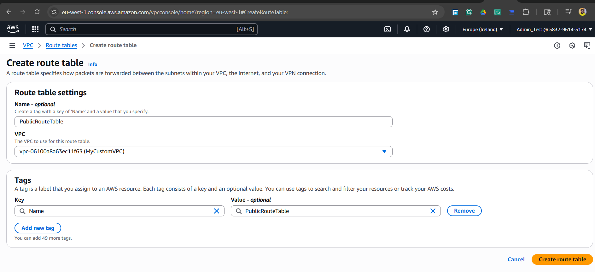
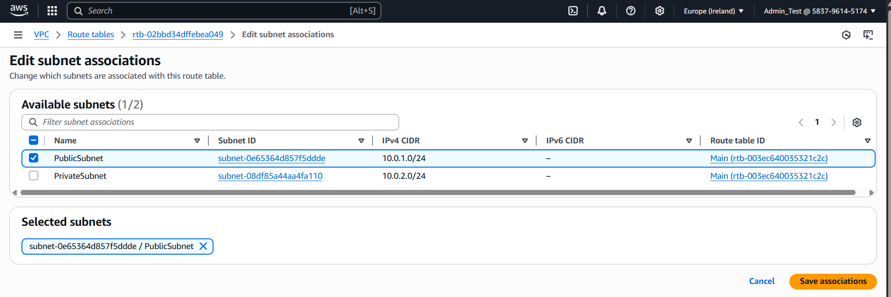


---

## 3️⃣ Launching EC2 Instances

### Public EC2 Instance
- Launched in the **public subnet**
- Enabled **Auto-assign Public IP**
- Opened **ports 22 (SSH)** and **80 (HTTP)** in the security group

### Private EC2 Instance
- Launched in the **private subnet**
- No public IP assigned
- Used the **public EC2** as a bastion host to SSH into the private instance

### Screenshots:
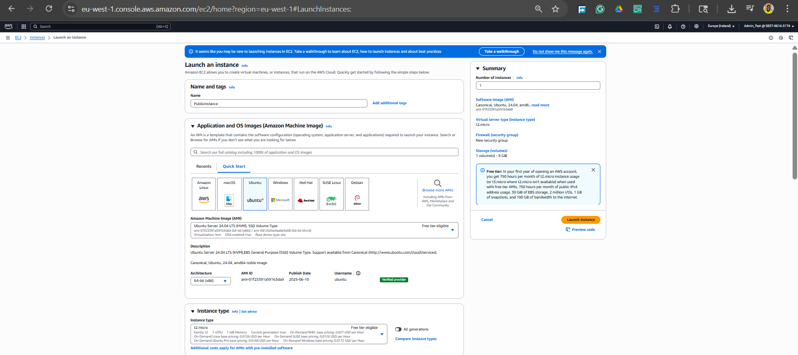
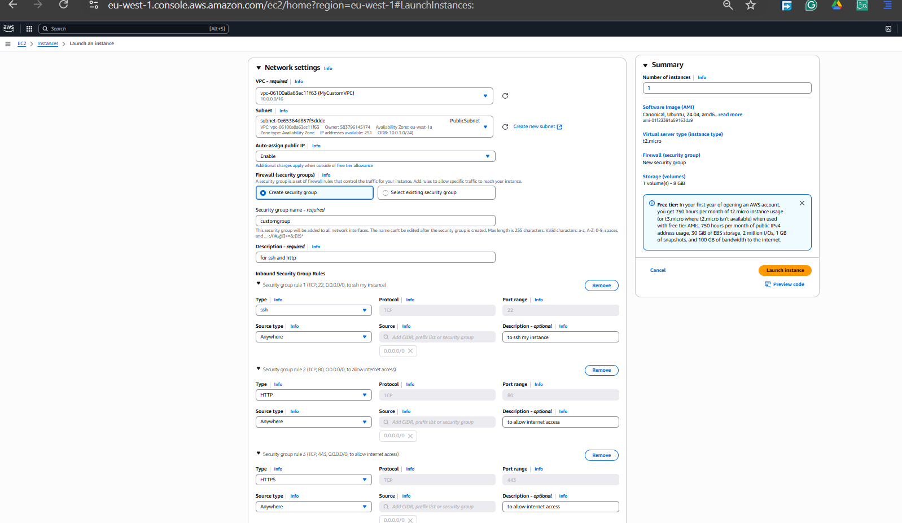


---

## 4️⃣ S3 Static Website Hosting

### Bucket Configuration
- Created S3 bucket: `my-static-website-ire`
- Disabled “Block all public access”
- Enabled **Static Website Hosting** under bucket **Properties**
  - Index document: `index.html`
  - style: `style.css`
 - script: `script.css`
 
### Screenshots:
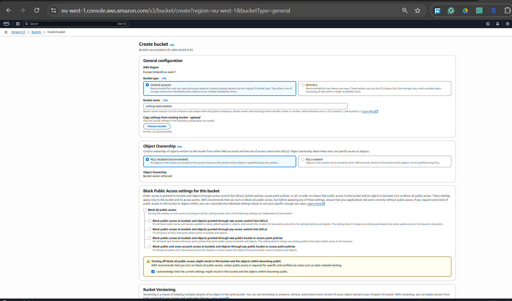
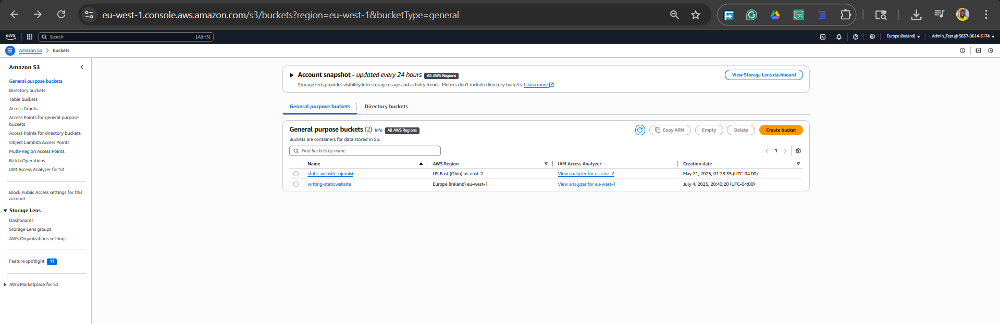
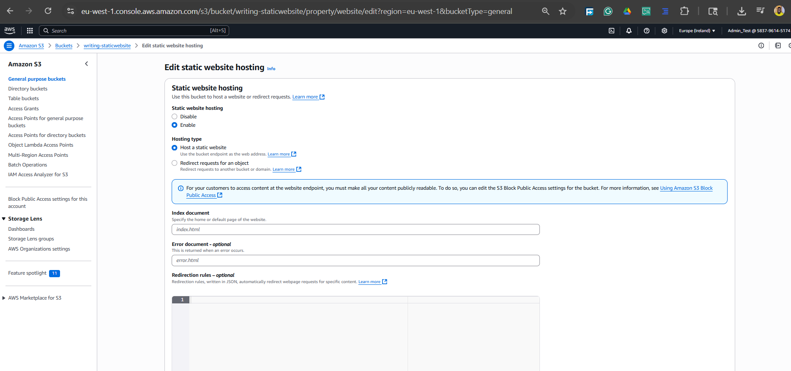
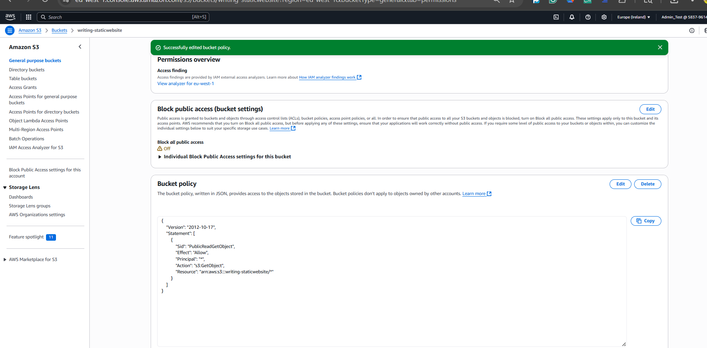
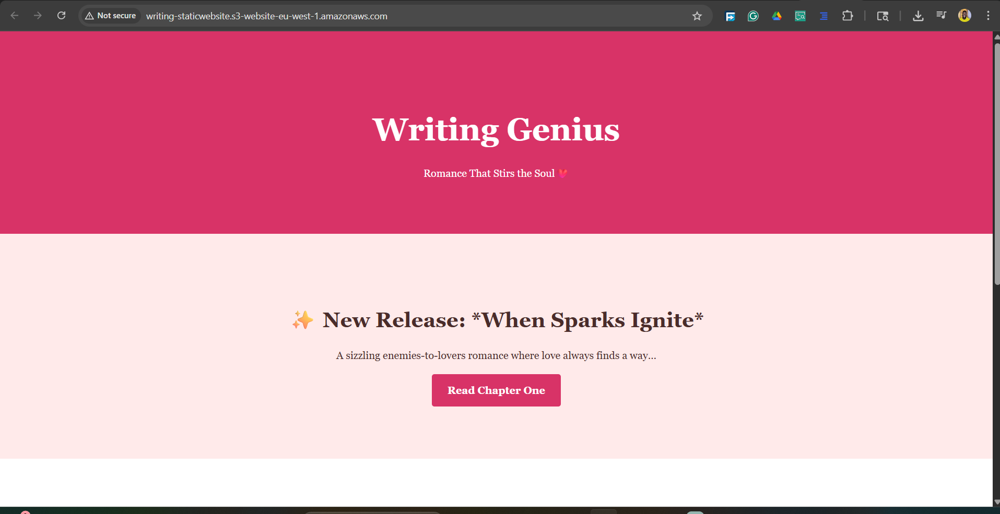


### Permissions
Added the following **bucket policy** to allow public read access:

```json
{
  "Version": "2012-10-17",
  "Statement": [
    {
      "Sid": "PublicReadAccess",
      "Effect": "Allow",
      "Principal": "*",
      "Action": "s3:GetObject",
      "Resource": "arn:aws:s3:::my-static-website-ire/*"
    }
  ]
}
